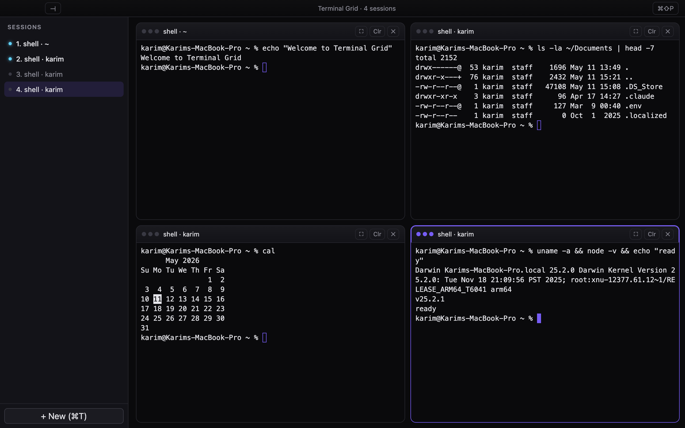
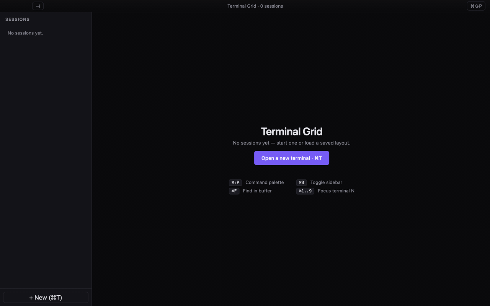
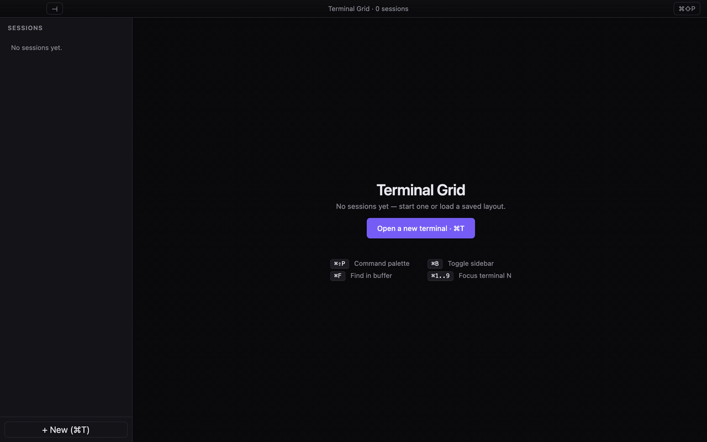
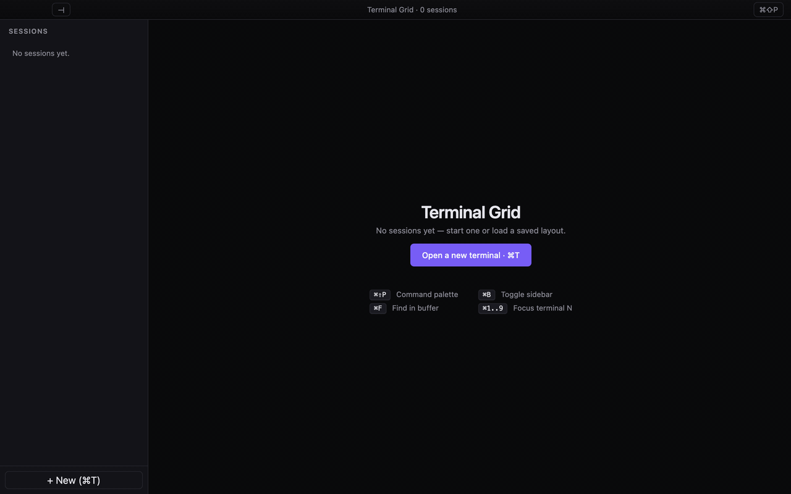
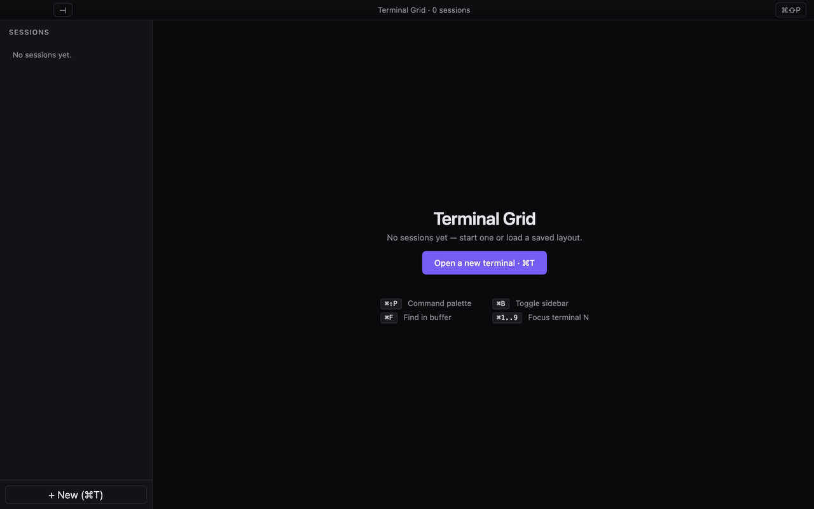
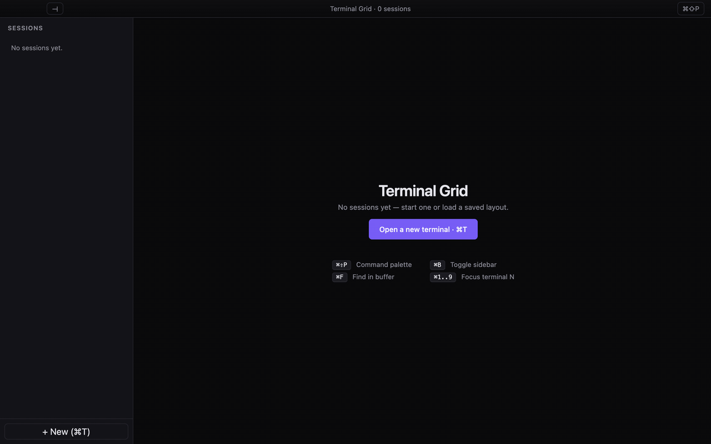
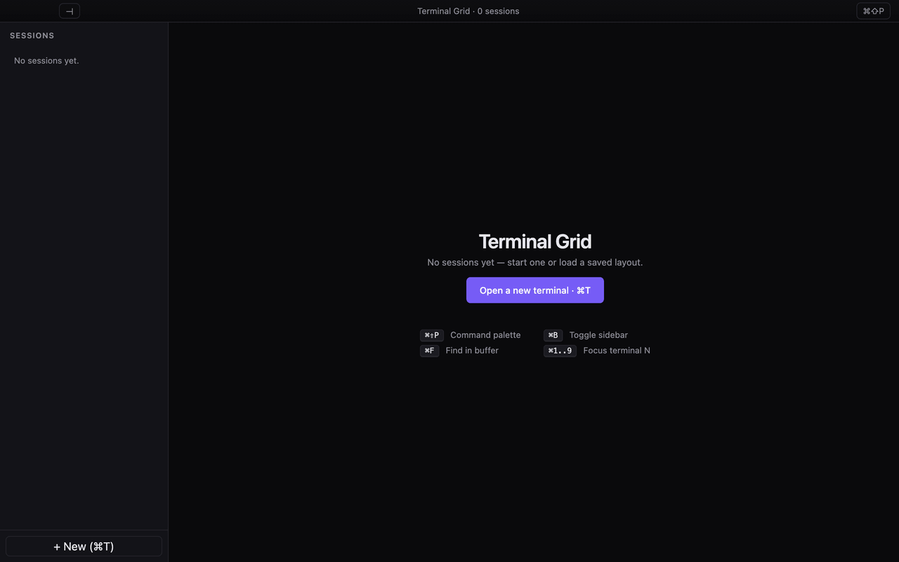

<div align="center">

# Terminal Grid

**A dynamic grid of terminal emulators backed by persistent user sessions.**

Built with Electron · React · TypeScript · xterm.js · node-pty.

[](#testing)
[](#install)
[](#license)



</div>

---

## Why

Tiling terminals — `tmux`, iTerm split panes, alacritty multiplexers — solve the "many shells in one window" problem, but they're modal, keyboard-only, and have no UI for the things you keep redoing: re-opening yesterday's layout, archiving a session you might come back to, naming a window something other than `zsh`. Terminal Grid is a small, focused desktop app that treats a workspace of terminals like a first-class object. Layouts persist. Sessions have names. Sidebars exist.

## At a glance

| | |
|---|---|
| **Open a terminal, run a command** |  |
| **`cd`, `ls`, anything you'd run in a normal shell** |  |
| **Split into a grid — `⌘T` adds a pane** |  |
| **Right-click for archive, duplicate, rename, restart…** |  |
| **Search scrollback with `⌘F`** |  |
| **Command palette · `⌘⇧P` — layouts, themes, presets** |  |
| **Dark · Light · System themes** |  |

## Features

**Layout**
- Dynamic grid that adapts to pane count (1 / 2×2 / 3×3 / 4×4)
- Manual layout chooser: `1 col`, `2 col`, `3 col`, `auto`, `tabs-only`
- Drag-resizable sidebar (160–480 px)
- Pointer-based reorder (drag any pane header)
- Zoom focused pane to fill the grid
- Layout presets — save and restore named workspaces

**Sessions**
- Persistent across app restarts (terminals, names, layout, window bounds)
- Smart default titles: `shell · <cwd-basename>` — updates live as you `cd`
- Cwd inheritance: new terminal opens in the focused terminal's working directory
- Activity dot in sidebar when an inactive terminal emits output
- Bell glyph when an inactive terminal rings the BEL
- Restart action when a shell exits (button + `⌘R`)
- Archive — set aside a session for later; one click restores it

**UX details**
- Right-click context menu on panes and sidebar items
- Single-click rename on the focused pane title (or double-click anywhere)
- Confirm-on-close when a foreground process is running
- Native macOS app menu (File · Edit · View · Window)
- System copy/paste (`⌘C` copies xterm selection, `⌘V` pastes to pty)
- Scrollback search (`⌘F`) with next / prev / Esc
- Theme: dark · light · system (follows `prefers-color-scheme`)
- Font size shortcuts: `⌘=` / `⌘−` / `⌘0`

**Reliability**
- `node-pty` for true PTY sessions (not a child-process wrapper)
- Per-terminal IPC channels — no O(N²) data fanout at scale
- Electron internal env vars (`ELECTRON_*`, `NODE_OPTIONS`) stripped from the shell environment
- Shell fallback chain: `$SHELL` → `os.userInfo().shell` → `/bin/zsh` → `/bin/bash` → `/bin/sh`
- ResizeObserver-gated PTY spawn — no NaN/0 sizes leaking to node-pty
- Reactive StrictMode-safe pty lifecycle

## Install

### Option A — download a `.dmg` (recommended)

1. Grab the latest release from [Releases](https://github.com/KarimJebara/Grid/releases), or build it yourself: `npm install && npm run package` — output is in `release/`.
2. Open the `.dmg`, drag **Terminal Grid** into **Applications**.
3. **First launch:** right-click the app → **Open** → **Open** (the app is currently unsigned, so macOS asks you to confirm).

`Terminal Grid-2.0.0-arm64.dmg` — Apple Silicon
`Terminal Grid-2.0.0.dmg` — Intel

### Option B — run from source

```bash
git clone git@github.com:KarimJebara/Grid.git
cd Grid
npm install
npm run rebuild         # rebuild node-pty for Electron's Node ABI
npm run dev             # launches the app
```

**Requirements:** Node 20+, Xcode CLT (`xcode-select --install`) for the native rebuild step.

## Keyboard shortcuts

| Action | Shortcut |
|---|---|
| New terminal | `⌘T` |
| Close focused | `⌘W` |
| Focus terminal N | `⌘1`…`⌘9` |
| Move focused left / right | `⌘⌥←` / `⌘⌥→` |
| Zoom focused pane | `⌘E` |
| Toggle sidebar | `⌘B` |
| Command palette | `⌘⇧P` |
| Find in buffer | `⌘F` |
| Restart shell (when exited) | `⌘R` |
| Duplicate focused (same cwd) | `⌘D` |
| Copy selection | `⌘C` |
| Paste to pty | `⌘V` |
| Font size + / − / reset | `⌘=` / `⌘−` / `⌘0` |
| Rename focused pane title | double-click title · or single-click when focused |

All shortcuts also live in the command palette (`⌘⇧P`).

## Architecture

```
┌──────────────────────────────────────────────────────────────┐
│ Electron main (node)                                         │
│ ┌──────────────┐  ┌────────────────┐  ┌───────────────────┐  │
│ │ PtyManager   │  │ Store          │  │ App menu          │  │
│ │ node-pty     │  │ electron-store │  │ (macOS native)    │  │
│ └──────┬───────┘  └────────┬───────┘  └────────┬──────────┘  │
│        │                   │                   │             │
│   IPC (per-id channels: pty:data:<id>, pty:exit:<id>, …)     │
└────────┼───────────────────┼───────────────────┼─────────────┘
         │                   │                   │
┌────────┼───────────────────┼───────────────────┼─────────────┐
│ Electron renderer (React + TypeScript)                       │
│ ┌──────▼────────┐  ┌───────▼───────┐  ┌────────▼───────────┐ │
│ │ TerminalPane  │  │ useLayout     │  │ useSettings        │ │
│ │ xterm.js +    │  │ — terminals,  │  │ — theme, font,     │ │
│ │ FitAddon +    │  │   archived,   │  │   persistence      │ │
│ │ SearchAddon + │  │   presets,    │  │                    │ │
│ │ WebLinksAddon │  │   layout      │  │                    │ │
│ └───────────────┘  └───────────────┘  └────────────────────┘ │
│ Sidebar · ContextMenu · CommandPalette · empty state         │
└──────────────────────────────────────────────────────────────┘
```

### Repo layout
```
src/
├─ main/                # Electron main process
│  ├─ index.ts          # window + IPC handlers + lifecycle
│  ├─ pty-manager.ts    # node-pty sessions, cwd, child-detection
│  ├─ store.ts          # electron-store wrapper
│  └─ menu.ts           # macOS app menu
├─ preload/             # contextBridge — typed `window.api`
├─ renderer/            # React + xterm.js UI
│  └─ src/
│     ├─ App.tsx
│     ├─ TerminalPane.tsx
│     ├─ ContextMenu.tsx
│     ├─ CommandPalette.tsx
│     ├─ SidebarItem.tsx
│     ├─ useLayout.ts
│     ├─ useSettings.ts
│     ├─ useActivity.ts
│     └─ styles.css
└─ shared/types.ts      # IPC contracts shared across processes
e2e/                    # Playwright + _electron tests (53 passing)
scripts/                # demo recorder, probes
```

## Testing

```bash
npx playwright test          # full suite — 53 tests in ~80s
npx playwright test --ui     # watch mode
```

Test coverage spans 6 files:
- `smoke.spec.ts` — boot, open terminal, shortcuts under xterm focus
- `deep.spec.ts` — prompt visibility, rename, zoom, persistence, isolation
- `edge.spec.ts` — keyboard reorder, clear, sidebar interactions, window resize, process exit, 10-pane stress
- `pr1.spec.ts` — reliability (env leak, throughput, restart, rapid create/close)
- `pr2.spec.ts` — native feel (cwd inheritance, app menu, window bounds, clipboard)
- `pr3.spec.ts` — power features (activity dot, search, layout, theme, font size, pointer drag)
- `pr4.spec.ts` — context menu, archive/restore, duplicate, sidebar toggle

## Tech stack

- **Electron** 32 · **electron-vite** for fast HMR + ESM
- **React** 18 · **TypeScript** 5 (strict)
- **xterm.js** 5.5 with `@xterm/addon-fit`, `@xterm/addon-search`, `@xterm/addon-web-links`
- **node-pty** for true pseudo-terminals
- **electron-store** for JSON-on-disk persistence
- **Playwright** for E2E against the actual Electron binary
- **electron-builder** for the `.dmg`

## How the demos were made

The GIFs above are not screen recordings — they're produced deterministically:

```bash
node scripts/record-demos.mjs
```

The script launches the production-built Electron binary via Playwright, drives it through a sequence of demo flows, captures 12 FPS PNG frames per demo, then `ffmpeg`-assembles each into a paletted GIF (`palettegen` + `paletteuse` with Bayer dithering) and emits a still PNG. Total runtime: ~60 seconds.

## Roadmap

Things I haven't shipped yet but want to:

- Windows + Linux builds (the renderer is portable; needs build target wiring + a Windows equivalent for `lsof`/`pgrep`)
- Code signing + notarization for friction-free first launch
- ConPTY support tested on Windows
- Scrollback persistence to disk (currently restored sessions get a fresh shell)
- Settings panel (`⌘,`) — currently you change theme/font via palette
- Drag-and-drop to detach a pane into a new window
- A `.tg` URL handler so `tg://session?cwd=…&shell=…` opens directly into a configured layout

PRs welcome.

## License

MIT
